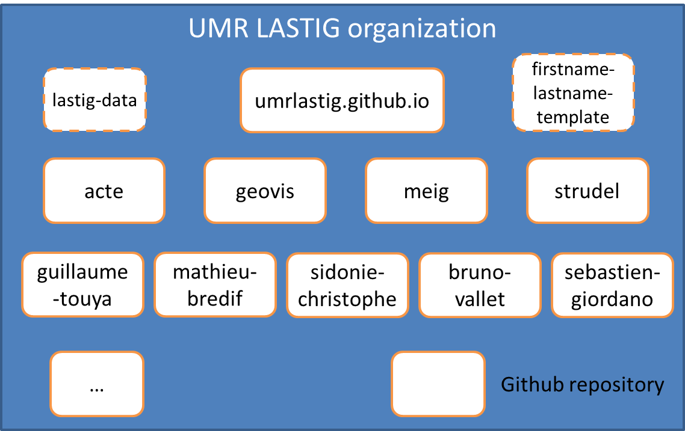
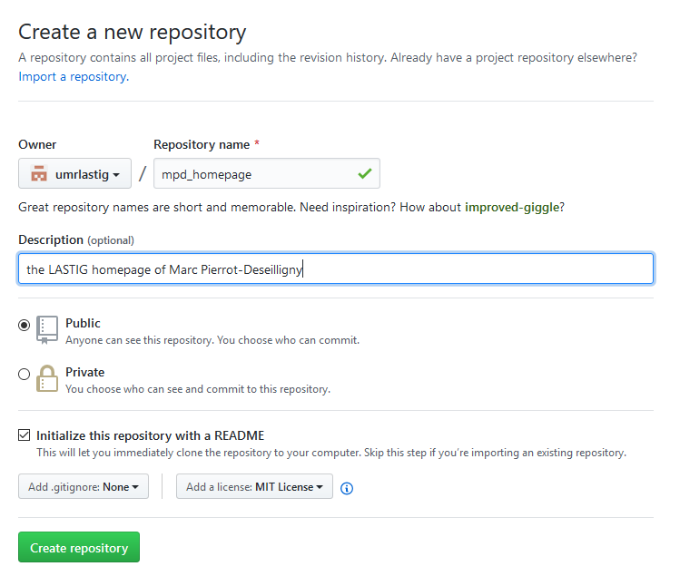
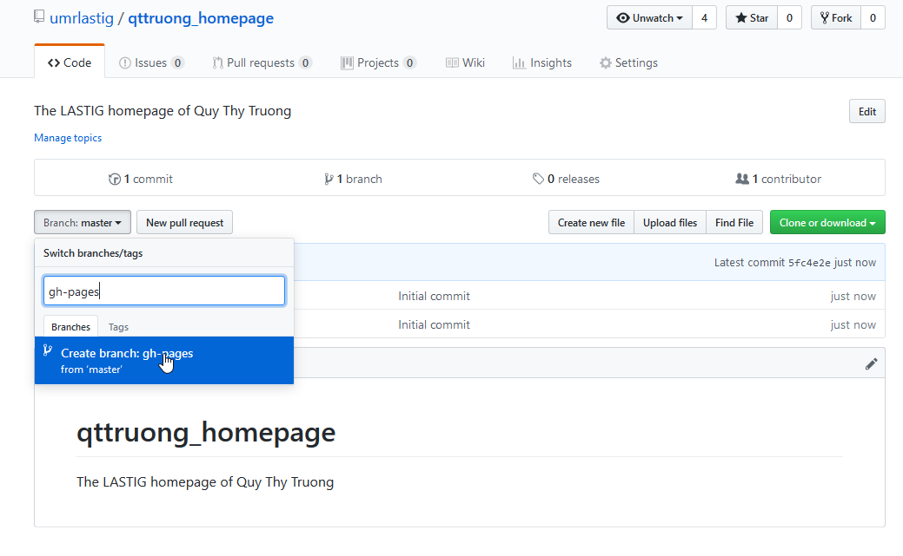
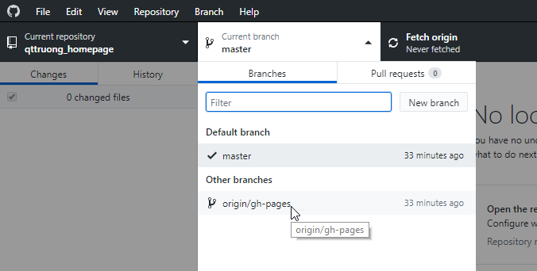
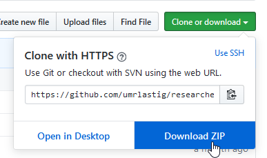
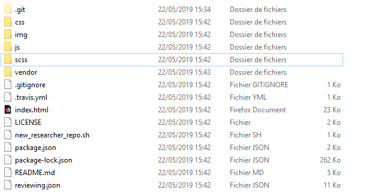

# [Start Bootstrap - Resume](https://startbootstrap.com/template-overviews/resume/)

modèle de requête REST pour récupérer les publications HAL d'un chercheur : https://api.archives-ouvertes.fr/search/?q=authIdHal_s:%22guillaume-touya%22&wt=json
La même requête mais qui renvoie la citation de chaque dépôt : https://api.archives-ouvertes.fr/search/?q=authIdHal_s:%22guillaume-touya%22&wt=json&fl=citationFull_s
Lien vers tous les champs disponibles dans HAL : https://api.archives-ouvertes.fr/docs/search/?schema=fields#fields
tutoriel pour se connecter à une API REST en JavaScript : https://www.taniarascia.com/how-to-connect-to-an-api-with-javascript/

[Resume](https://startbootstrap.com/template-overviews/resume/) is a resume and CV theme for [Bootstrap](http://getbootstrap.com/) created by [Start Bootstrap](http://startbootstrap.com/). This theme features a fixed sidebar with content sections to build a simple, yet elegant resume.

# How to use this template to create your homepage
This repository contains a template for the homepage of the LASTIG researchers. You can find below a tutorial to create your homepage using this template.

## Create a Github account and get invited in UMR LASTIG organization
The first step is to create an account on Github and to become a member of the [UMR LASTIG organization on Github](https://github.com/umrlastig/).
The website architecture is described in the image below. Github repositories are contained in the [UMR LASTIG organization](https://github.com/umrlastig/). There is one repository for the [homepage of the lab](https://github.com/umrlastig/website), one repository for the homepage of each of the four research teams (e.g. [GEOVIS team repository](https://github.com/umrlastig/geovis)), and one repository for each member of the LASTIG to host his/her homepage (e.g. [Guillaume Touya's homepage repository](https://github.com/umrlastig/gtouya_homepage)). The architecture of the website was designed this way for a simple management of administration rights: as each researcher creates his/her own repository to host his/her homepage, each researcher is the administrator of the homepage, and has the responsibility to keep it up-to-date.

A template to build a homepage is provided in the [researcher_homepage repository](https://github.com/umrlastig/researcher_homepage). The following sections of this tutorial explain how to use this template.

To get invited in this LASTIG organization, please contact one of the administrators of the organization (for instance your research team leader) with the login of your Github account.

## Create your homepage repository
Once you are a member of the [UMR LASTIG organization](https://github.com/umrlastig/), you can create a new repository on the Github website by clicking on the green up-right button "New". Then, you have to give information on your repository (see the example in the image below). Please select a "Public" repository, it will help for the management of the website.

Once the repository is created navigate to the webpage of the repository. The website will be hosted here thanks to the [Github pages technology](https://pages.github.com/). To have a website hosted here and generated from the files in the repository, you have to create a branch of the repository called "gh-pages". So, click on the button "Branch:master" (see image below), type "gh-pages", and then click below on "Create branch: gh-pages".

Then, Github should switch to this new gh-pages branch, to contains only the license and the readme files from the master branch. Arrived here, you already have your homepage at the following address "https://umrlastig.github.io/name_of_your_repo". For now, the homepage is quite empty and only displays the content of the readme.md file.

## Clone the repository on your computer
From now on, most of the work to create your homepage will be done from your desktop computer and not online on the Github website anymore. So, you need to clone your repository on your computer. You have two options to clone the repository with a git terminal, or with the [Github Desktop application](https://desktop.github.com/).

### Clone with Git terminal

* In the repository Github page, click "Clone or download" green button on the right.

* In the popup that opens, copy the URL of the repository (see image below).

* Open a Bash or a Terminal.

* Change the current working directory to the location where you want the cloned directory to be made.

* Type git clone, and then paste the URL you copied just before

> $ git clone https://github.com/umrlastig/your_repo_name.git

* Press Enter. Your local clone of the repository will be created.

* Then, switch to the "gh-pages" branch you create earlier:

> $ git checkout gh-pages

### Clone with Github Desktop

* Install the Github Desktop application

* In the repository Github page, click "Clone or download" green button on the right.

* In the popup that opens (see image above), click on the "Open in Desktop" button. See this [Github tutorial](https://help.github.com/en/desktop/guides/contributing-to-projects/cloning-a-repository-from-github-to-github-desktop/) for more information.

* Then, switch to the "gh-pages" branch you create earlier:

## Copy the template into your repository

Arrived here, you have the files of the repository branch gh-pages in a folder called "your_repo_name" (e.g. "qttruong_homepage" in the tutorial images). You can check the folder on your computer, it should contain two files (LICENSE, and README.md). Now we are going to copy the template homepage into this folder.

The easiest way to do this is the following:
* Go to the [template repository](https://github.com/umrlastig/researcher_homepage/tree/gh-pages).

* Click on the "Clone or download" green button and then click on "Download ZIP" (see image below).

* Download the .zip file somewhere on your computer. Then, unzip it somewhere and copy all the files directly into your repository local folder. You should have the files displayed in the image below copied in your local folder.

Now, your website is ready but only in your local folder. You need to commit and push it to Github to have it available on the web. You can do both either with the Git shell or with Github desktop. Don't forget to push your new files to your remote Github repo after you commit them.

After the Push, if you look at the address of your homepage ("https://umrlastig.github.io/name_of_your_repo"), you should now see the template homepage rather than the README.md file. You are now ready to modify the template with your own information.

## Fill the template with your personal information

## Copyright and License

Copyright 2013-2019 Blackrock Digital LLC. Code released under the [MIT](https://github.com/BlackrockDigital/startbootstrap-resume/blob/gh-pages/LICENSE) license.
